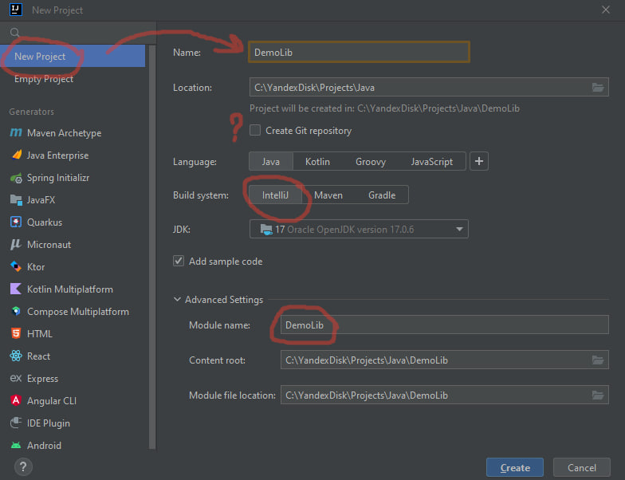
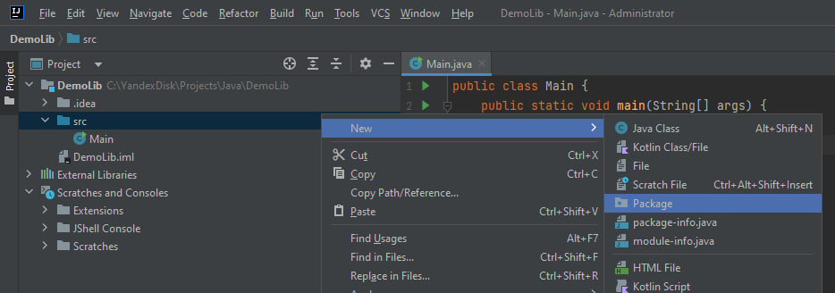
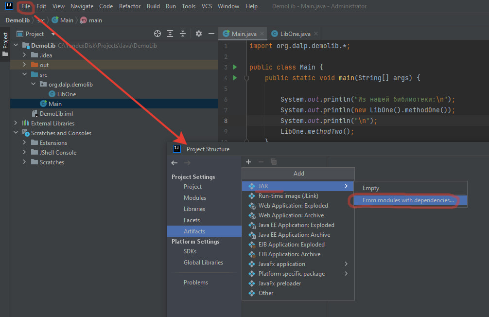
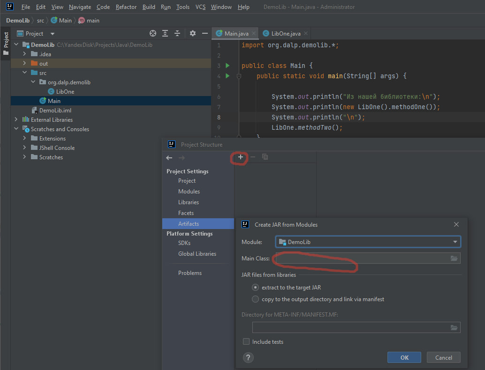
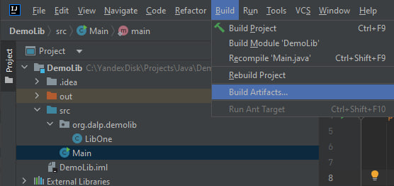
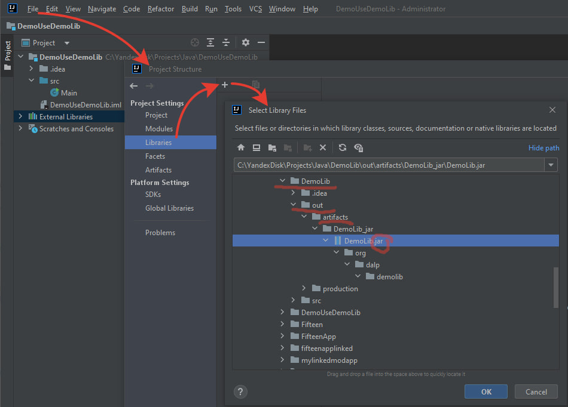
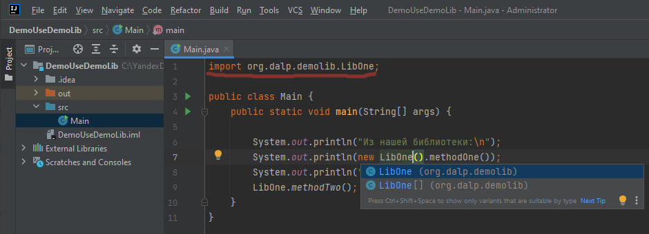

# Как создать и подключить библиотеку классов в IDE IntelliJ Idea


## Создать новый проект: *File - New - Project - Empty*

 
   - Название **DemoLib**:
       - Вообще-то если планируется создавать несколько классов,
         то именем проекта нужно указывать название его сущности во множественном числе.
         А вот имя пакета[ов] (aka package) - в единственном. Например:
           - Модуль *Utils*, пакет *org.dalp.util*, внутри классы объектов.
         Но здесь имя - Lib aka Библиотека - и так уже подразумевает в содержимом множественность объектов.
         Поэтому назвал в единственном числе, ибо, КМК, Libs - это уже как "ножницыы" :)

## Создать пакет *org.dalp.demolib*


## Создать пару демо-классов
***src/org/dalp/demolib/LibOne.java***
```
package org.dalp.demolib;
public class LibOne {
    public String methodOne() {
        return new Throwable().getStackTrace()[0].getMethodName();
    }

    public static void methodTwo() {
        System.out.println(
            (new Throwable().getStackTrace()[0].getClassName())
            + "." + (new Throwable().getStackTrace()[0].getMethodName())
        );
    }
}
```
***org/dalp/demolib/LibTwo.java***
```
package org.dalp.demolib;

public class LibTwo {
    public String methodTwoOne() {
        return new Throwable().getStackTrace()[0].getMethodName();
    }

    public static void methodTwoTwo() {
        System.out.println(
            (new Throwable().getStackTrace()[0].getClassName())
            + "." + (new Throwable().getStackTrace()[0].getMethodName())
        );
    }
}
```
 
## Конфигурация артефактов (aka бинарников) модуля .jar




**FYI: *Main Class указывать не надо***

## Скомпилить артефакты.


*Теперь в папке с артефактами лежит jar*:
  ***out/artifacts/DemoLib_jar/DemoLib.jar***

## Теперь как эту либу подключить к своему проекту

### Создать проект DemoUseDemoLib

### Добавить во внешние библиотеки 


File - Project structure - Project settings - Libraries - "+" - указать соотв. jar

### Создать (или исправить) PVSM (aka src\Main.java)
```
import org.dalp.demolib.LibOne;

public class Main {
    public static void main(String[] args) {

        System.out.println("Из нашей библиотеки:\n");
        System.out.println(new LibOne().methodOne());
        System.out.println("\n");
        LibOne.methodTwo();
    }
}
```
#### Должно выглядеть где-то так



Запускаем, все должно работать.